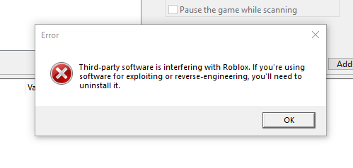
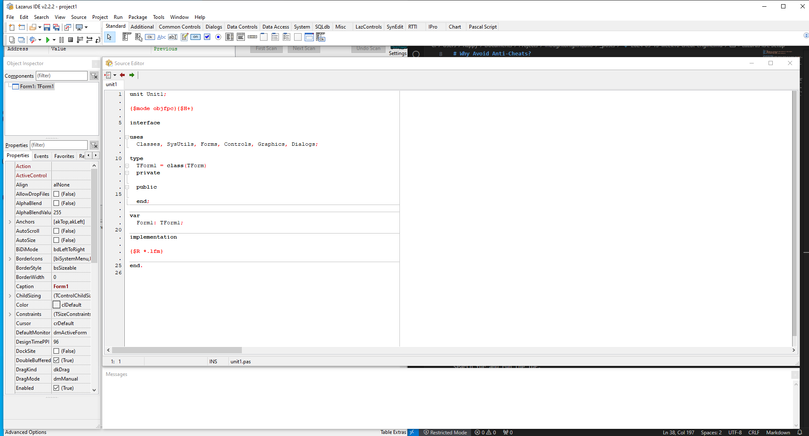
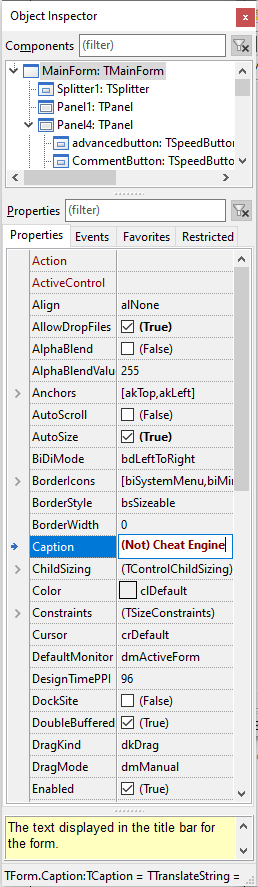
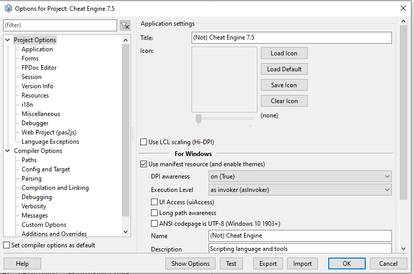

# Why Avoid Anti-Cheats?
For fun me and my friends somewhat immaturely sometimes play the children's game [Roblox](https://www.roblox.com/), an online minigame based game. One thing we sometimes get up to is exploiting the badly made flaws in games, getting out of bounds and finding exploits, but I've always wanted a little more power, and some low-quality games leave variables client-sided (meaning we can modify them and the game accepts them) so I wanted to modify them to do new exploits.

My target of choice is the game hacking tool [Cheat Engine](https://www.cheatengine.org/) because it is the goto for developing stronger exploits, providing memory scanning, speedhacks and debugging features to find good offsets (pointer to useful memory addresses) for functions and variables.

Currently running Roblox and hooking Cheat Engine triggers this message:

And by the end of the post we will stop this from occurring

# What do we need to circumvent
In this article we will circumvent some common detection methods:
- Checksumming (comparing running programs to known hacks)
- Driver Identification
- String Scanning (reading program memory to find known hack names)
- Driver Signature Checking
- Debugger Detection (mentioned only briefly)

# Checksumming & Driver Identification
Checksumming is the easiest hack detection method to circumvent, and is as simple as slightly modifying the source code of a hack so it has different bytes. Cheat Engine is open source, written in Pascal using the Lazarus IDE, its source code can be found [here](https://github.com/cheat-engine/cheat-engine).

To start we can change the driver name (part of circumventing driver identification), which will also change the signature of Cheat Engine.

To change the driver name we go to "Cheat Engine/dbk32" and edit 'DBK32function.pas' to change all mention of dbk64.sys and dbk32.sys to something new such as mydriver64/32.sys

We also channge the servicename variable from 'CEDRIVER73' to a new name e.g. 'MYCOOLDRIVER'

# Lazarus IDE Setup
To start editing the program fully we need the lazarus compiler, which can be found at https://www.lazarus-ide.org/index.php?page=downloads and from there we need 'lazarus-2.2.2-fpc-3.2.2-win32.exe' and 'lazarus-2.2.2-fpc-3.2.2-cross-x86_64-win64-win32.exe' to get the compiler and needed plugins.

Run 'lazarus-2.2.2-fpc-3.2.2-win32.exe' first and then 'lazarus-2.2.2-fpc-3.2.2-cross-x86_64-win64-win32.exe' to get the extra plugins. After this you should be able to search for and run the IDE.

It's a tiny bit weird as you can see, not being a fullscreen program but instead made of lots of little windows, which is a conscious design decision.

# String Scanning
To start open the file "Cheat Engine/cheatengine.lpi" to open the project in Lazarus IDE. Next we want to simply change the window title so we change the field 'Caption' in the object inspector to something new.

Next go to 'Project -> Project options' (or press Shift+Control+F11) and click 'Clear Icon' as well as change the 'Name' field to something new.

<small> <i> Note: I put '(Not) Cheat Engine' as my name but remove all mentions of the name Cheat Engine from the title if you're doing it for the best results! </i> </small>

Next go to the 'Version Info' tab and change the 'Other Info' CompanyName and FileDecription fields.

Then go to 'Compiler Options -> Paths' and change the 'Target file name' field to something new for each build mode.

Then it OK and select 'Run > Compile many Modes...' and check 'Release 64-Bit' and 'Release 64-Bit O4 AVX2'

Finally we can use a hex editor (I use [HxD](https://mh-nexus.de/en/hxd/)) to modify the compiled executable we made (found in "Cheat Engine/bin"), and do a replace in the binary for any mentions of 'Cheat Engine' with a new string of the same length e.g. 'MyNew Engine'.

# Driver Signature Checking
Open the "DBKKernel" folder in the Cheat Engine source code and open 'DBKKernel.sln' to open the Visual Studio project.

Open 'DBK64.inf' and search and replace for 'DBK64' with the name you chose for the driver earlier. Also change ManufacturerName="Cheat Engine" to something new. Repeat for DBK32.inf if doing 32-bit driverss too.

Open the project options and switch to "Release Without Sig" as the configuration and "x64" for the build mode. Then build the solution and the driver will appear in the previous 'bin' folder.

# Conclusion
From here you have circumvented most anticheats for a short while, having prevented them from identifying your cheat program and its drivers. If the cheat becomes detected you can modify it further to make it undetected again (and there are good methods for keeping the cheat looking unique to detection systems, such as VMProtect, which helps with stopping debugger detection too).

Now we get no issue from Roblox:

And we can scan memory freely:
